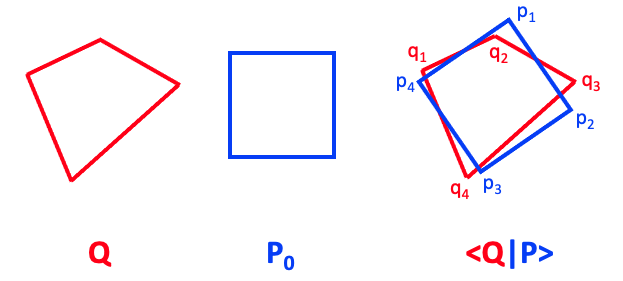
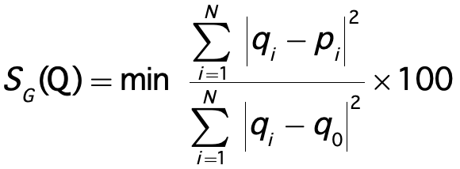
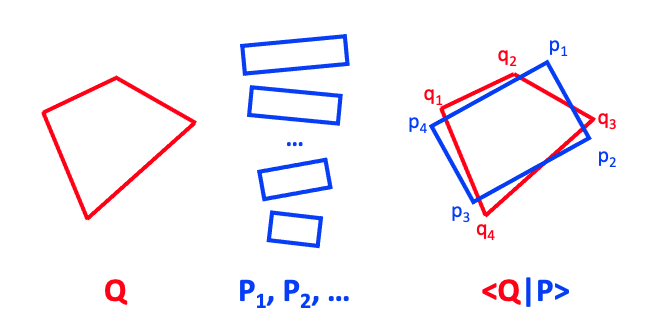
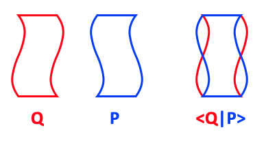
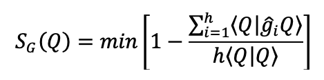
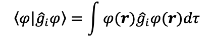
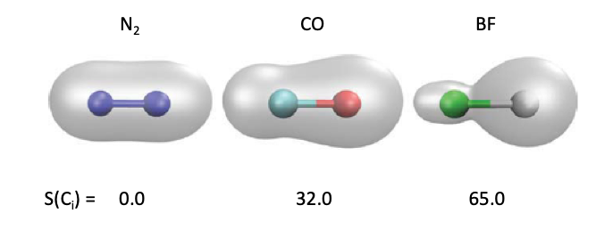

.. highlight:: rst

Introduction
************

**Cosymlib** is a a python library for computing continuous symmetry & shape measures (CSMs & CShMs).
Although most of the tools included in **cosymlib** have been devised especially with the purpose of
analyzing the symmetry & shape of molecules as proposed initially by D. Avnir and coworkers [AVN]_,
many of the procedures contained in **cosymlib** can be easily applied to any finite geometrical object
defined by a set of vertices or a by mass distribution function.

--------------

.. [AVN] a) H. Zabrodsky, S. Peleg, D. Avnir, "Continuous symmetry measures",
    *J. Am. Chem. Soc.* (1992) **114**, 7843-7851.

    b) H. Zabrodsky, S. Peleg, D. Avnir, "Continuous Symmetry Measures II: Symmetry Groups
    and the Tetrahedron", *J. Am. Chem. Soc.* (1993) **115**, 8278–8289.

    c) H. Zabrodsky, D. Avnir, "Continuous Symmetry Measures, IV: Chirality" *J. Am. Chem. Soc.* (1995)
    **117**, 462–473.

    d) H. Zabrodsky, S. Peleg, D. Avnir, "Symmetry as a Continuous Feature" IEEE, *Trans. Pattern. Anal. Mach. Intell.*
    (1995) **17**, 1154–1166.

    e) M. Pinsky, D. Avnir, "Continuous Symmetry Measures, V: The Classical Polyhedra" *Inorg. Chem.*
    (1998) **37**, 5575–5582.

--------------

Continuous Shape Measures (CShMs)
---------------------------------

In a nutshell, the continuous shape measure S\ :sub:`P`\ (Q) of object Q with refespect to the
reference shape P is an indicator of how much Q resembles another object P\ :sub:`0`\  with a given
ideal shape, for instance a square as in the figure below.

Given that the shape is invariant upon
translations, rotations, and scaling, the most evident way to compare the two objects is to translate,
rotate and scale one of them, for instance P\ :sub:`0`\, until we maximize the overlap <Q|P> between
Q and P, where P is the image of P\ :sub:`0`\  after these transformations.

If both the problem and the reference structures Q and P are defined as a set of vertices, we can
define the shape measure simply as:

.. image:: images/CShM_eq.png
    :height: 105px
    :align: center

where N is the number of vertices in the structures we are comparing, q\ :sub:`i`\  and
p\ :sub:`i`\  are the position vectors of the vertices of Q and P, respectively,
and q\ :sub:`0`\  the geometric center of the problem structure Q. The minimization in this
equation refers to the relative position, orientation, and scaling that must be applied
to P\ :sub:`0`\  to minimize the sum of squares of distances between their respective vertices,
which is equivalent to maximizing the overlap <Q|P>. If the matching of the two shapes is described,
as in the equation above by the distance between vertices of the two objects, a further minimization
with respect to all possible ways to label the N vertices in the reference structure P\ :sub:`0`\  is
also needed.

From the definition of S\ :sub:`P`\ (Q)  it follows that if Q and P have exactly the same shape,
then S\ :sub:`P`\ (Q) = 0. Since S\ :sub:`P`\ (Q)  is always positive, the larger its value, the
less similar is Q to the ideal shape P. It can be shown that the maximum value for
S\ :sub:`P`\ (Q) is 100, corresponding to the unphysical situation for which all vertices
of Q collapse into a single point. A more detailed description of continuous shape measures and
some of their applications in chemistry may be found in the following references: [CShM]_.

---------------------------

.. [CShM] a) M. Pinsky, D. Avnir, "Continuous Symmetry Measures, V: The Classical Polyhedra" *Inorg. Chem.*
    (1998) **37**, 5575–5582.

    b) D. Casanova, J. Cirera, M. Llunell, P. Alemany, D. Avnir, and S. Alvarez,
    "Minimal Distortion Pathways in Polyhedral Rearrangements" *J. Am. Chem. Soc.* (2004)
    **126**, 1755–1763.

    c) S.Alvarez, P. Alemany, D. Casanova, J. Cirera, M. Llunell, D. Avnir, "Shape maps and polyhedral
    interconversion paths in transition metal chemistry" *Coord. Chem. Rev.* (2005) **249**, 1693–1708.

    d) K. M. Ok, P. S. Halasyamani, D. Casanova, M. Llunell, P. Alemany, S. Alvarez, "Distortions in
    Octahedrally Coordinated  d\ :sup:`0`\  Transition Metal Oxides: 
    A Continuous Symmetry Measures Approach" *Chem. Mater.* (2006) **18**, 3176–3183.

    e) A. Carreras, E. Bernuz, X. Marugan, M. Llunell, P. Alemany, "Effects of Temperature on the
    Shape and Symmetry of Molecules and Solids" *Chem. Eur. J.* (2019) **25**, 673 – 691.

---------------------------

Continuous Symmetry Measures (CSMs)
-----------------------------------

To define a continuous measure for the degree of symmetry of an object one may proceed
in the same way as for the definition of CShMs. The final result for the symmetry measure
with respect to a given point symmetry group G, denoted as S\ :sub:`G`\ (Q), yields an expression
totally analogous to the equation above, in which Q refers again to the problem structure,
but where P is now the G-symmetric structure closest to Q:

The minimization process in this case refers to the relative position of the two structures (translation),
the orientation of the symmetry elements for the reference G-symmetric structure P, the scale factor,
and again, the labeling of vertices of the symmetric structure. Note that although the same equation may
be used both to define shape and symmetry measures, there is a fundamental difference between the
two procedures: while in computing a shape measure we know in advance the reference object
P\ :sub:`0`\  , in the case of symmetry measures the shape of the closest G-symmetric structure
is, in principle, previously unknown and must be found in the procedure of computing S\ :sub:`G`\ (Q).

Consider, for instance that we would like to measure the rectangular symmetry for a given general
quadrangle. Besides optimizing to seek for the translation, rotation, and scaling that leads to the
optimal overlap of our quadrangle Q with a particular rectangle P as in a shape measure, we will need
to consider also which is the ratio between the side lengths of best matching rectangle and
optimize also with respect to this parameter.

Although this additional optimization process may seem difficult to generalize for any
given symmetry group, it has been shown that it is possible to do it efficiently
using either the folding–unfolding algorithm or via the calculation of intermediate symmetry
operation measures. As in the case of shape measures, the values of CSMs are also limited
between 0 and 100, with S\ :sub:`G`\ (Q) = 0, meaning that Q is a G-symmetric shape. A more detailed
description of continuous shape measures and some of their applications in chemistry may be found
in the following references: [CSM]_.

---------------------------

.. [CSM] a) H. Zabrodsky, S. Peleg, D. Avnir, "Continuous symmetry measures"
    *J. Am. Chem. Soc.* (1992) **114**, 7843-7851.

    b) Y. Salomon, D. Avnir, "Continuous symmetry measures: A note in proof of the folding/unfolding
    method" *J. Math. Chem.* (1999) **25**, 295–308.

    c) M. Pinsky, D. Casanova, P. Alemany, S. Alvarez, D. Avnir, C. Dryzun, Z. Kizner, A. Sterkin,
    "Symmetry operation measures" *J. Comput. Chem.* (2008) **29**, 190–197.

    d) M. Pinsky, C. Dryzun, D. Casanova, P. Alemany, D. Avnir, "Analytical methods for calculating
    Continuous Symmetry Measures and the Chirality Measure" *J. Comput. Chem.* (2008) **29**, 2712–2721.

    e) C. Dryzun, A. Zait, D. Avnir, "Quantitative symmetry and chirality—A fast computational
    algorithm for large structures: Proteins, macromolecules, nanotubes, and unit cells"
    *J. Comput. Chem.* (2011) **32**, 2526–2538

    f) M. Pinsky, A. Zait, M. Bonjack, D. Avnir, "Continuous symmetry analyses:  C\ :sub:`nv`\  and
    D\ :sub:`n`\  measures of molecules, complexes, and proteins" *J. Comput. Chem.* (2013) **34**, 2–9.

    g) C. Dryzun, "Continuous symmetry measures for complex symmetry group"
    *J. Comput. Chem.* (2014) **35**, 748–755.

    h) G.Alon, I. Tuvi-Arad, "Improved algorithms for symmetry analysis: structure preserving
    permutations" *J. Math. Chem.* (2018) **56**, 193–212.

---------------------------

Continuous Chirality Measures (CCMs)
------------------------------------

A special mention should be made to chirality, a specific type of symmetry that has a
prominent role in chemistry. A chiral object is usually described as an object that cannot be
superposed with its mirror image. In this sense, we could obtain a continuous chirality measure
by using the same equation as for shape measures just by replacing P by the mirror image of Q.

Technically speaking chirality is somewhat more complex since it implies the lack of
any improper rotation symmetry and its CCM can be based on estimating how close a given object
is from having this symmetry. Using the CSMs defined above, the continuous chirality measure
can be defined as the minimal of all S\ :sub:`G`\ (Q) values for S\ :sub:`n`\ (Q)
with n=1,2,4, … . In most cases it will be either for G = S\ :sub:`1`\  = C\ :sub:`s`\  or
G = S\ :sub:`2`\  = C\ :sub:`i`\ , whereas in a few cases we will have to look for G = S\ :sub:`4`\  or
higher-order even improper rotation axes. Since in most cases visual inspection of the studied
structure is enough in order to guess which one could be the nearest S\ :sub:`n`\  group,
a practical solution is just to calculate this particular S\ :sub:`G`\ (Q) value, or in case of
doubt, a few S\ :sub:`G`\ (Q) values  for different S\ :sub:`n`\  and pick the smallest one.
A more detailed description of continuous shape measures and some of their applications in
chemistry may be found in the following references: [CCM]_.

---------------------------

.. [CCM] a) H. Zabrodsky, D. Avnir, "Continuous Symmetry Measures, IV: Chirality"
    *J. Am. Chem. Soc.* (1995) **117**, 462–473.

    b) M. Pinsky, C. Dryzun, D. Casanova, P. Alemany, D. Avnir, "Analytical methods for calculating
    Continuous Symmetry Measures and the Chirality Measure"
    *J. Comput. Chem.* (2008) **29**, 2712–2721.

    c) C. Dryzun, A. Zait, D. Avnir, "Quantitative symmetry and chirality — A fast computational
    algorithm for large structures: Proteins, macromolecules, nanotubes, and unit cells"
    *J. Comput. Chem.* (2011) **32**, 2526–2538

---------------------------

CSMs for quantum chemical objects
---------------------------------

The use of the overlap <Q|P> between two general objects Q and P allows the generalization of
continuous symmetry and shape measures to more complex objects that cannot be simply described
by a set of vertices such as matrices or functions. In this case the definition of the continuous
symmetry measure is:

where Q is the given object and  g\ :sub:`i`\  the *h* symmetry operations comprised in the finite
point symmetry group G. The minimization in this case just refers to the orientation of the
symmetry elements that define the symmetry operations in G. The key elements in this definition
are the overlap terms <Q|g\ :sub:`i`\ Q> between the original object Q and its image under all the
h symmetry operations g\ :sub:`i`\  that form group G. The precise definition on how to obtain these
overlaps depends, of course, on the nature of the object Q. For molecular orbitals as obtained in
a quantum chemical calculation we have:

which is known as a SOEV (symmetry operation expectation value). For the electron density one
can use an analogous expression for the corresponding SOEV by replacing the orbital (one electron
wavefunction) by the whole electron density. Using this type of symmetry measures one is then able
to compare the symmetry contents of the electronic structure of molecules, for instance by comparing
the inversion symmetry measure for different diatomic molecules as in the example below:

The generalitzation of CSMs for functions, is of course, not limited to chemical applications and
it permits extending the notion of continuous symmetry measures to geometrical objects beyond
those defined by a set of vertices. A solid object of arbitrary shape, not restricted to a polyhedron,
can be described by a function corresponding to a constant mass distribution, and its corresponding
shape and symmetry measures can be easily computed by numerical integration to determine the SOEVs,
avoiding the cumbersome minimization over vertex pairings that appear for objects that are
defined by a set of vertices.

An interesting extension for functions which are not restricted to positive values, for instance,
molecular orbitals, is the possibility of calculating continuous symmetry measures for each individual
irreducible representation of a given point group. A more detailed description of the development and
some applications of CSMs in quantum chemistry may be found in the following references: [QCSMs]_.

---------------------------

.. [QCSMs] a) C. Dryzun, D. Avnir, "Generalization of the Continuous Symmetry Measure:
        The Symmetry of Vectors, Matrices, Operators and Functions" *Phys. Chem. Chem. Phys.* (2009)
        **11**, 9653–9666.

        b) C. Dryzun, D. Avnir, "Chirality Measures for Vectors, Matrices, Operators and Functions"
        *ChemPhysChem* (2011) **12**, 197–205.

        c) P. Alemany, "Analyzing the Electronic Structure of Molecules Using Continuous Symmetry
        Measures" *Int. J. Quantum Chem.* (2013) **113**, 1814–1820;

        d) P. Alemany, D. Casanova, S. Alvarez, C. Dryzun, D. Avnir, "Continuous Symmetry Measures:
        a New Tool in Quantum Chemistry" *Rev. Comput. Chem.* (2017) **30**, 289–352.