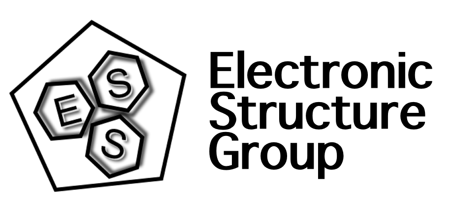

.. highlight:: rst

Links
=====

.. figure:: images/logo_iqtc.png
    :height: 100px
    :target: https://www.iqtc.ub.edu

.. figure:: https://www.nanogune.eu/sites/default/files/styles/large/public/DonostiaInternationalPhysicsCenter.jpg?itok=uodkqUAl
    :height: 100px
    :target: http://dipc.ehu.es

.. figure:: http://csm.ouproj.org.il/assets/images/COSYM_LOGO_168x67.png
    :height: 100px
    :target: http://csm.ouproj.org.il

`Prof. David Avnir Homepage <http://chem.ch.huji.ac.il/avnir/index.html>`_

`Dr. Inbal Tuvi-Arad Homepage <https://www.openu.ac.il/en/personalsites/InbalTuviArad.aspx>`_
