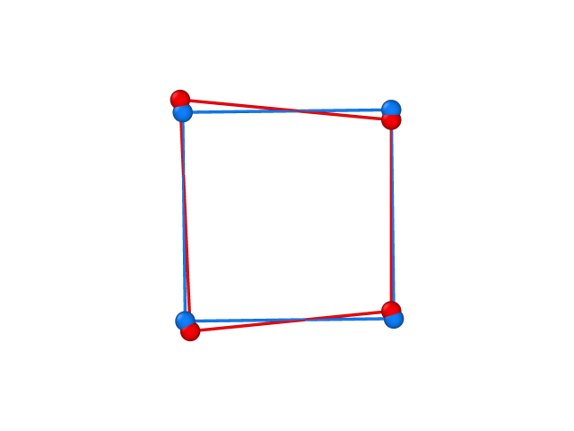

.. highlight:: rst

How to use cosymlib
*******************

**Cosymlib** is a a python library for computing continuous symmetry & shape measures (CSMs & CShMs).
Besides using the APIs contained in **cosymlib** to build your own custom-made python programs we have
also written some general scripts to perform standard tasks such as calculating a continuous shape
measure for a given structure without need of writing a python script. All this general task scripts
are called using a similar syntax wich inludes the name of the script, the name of the file containing
the structural data and optional arguments specifying the tasks we want to perform::

   $ script filename -task1 -task2 ... -taskn

For instance, consider a ``struct.xyz`` file containing the following structural information
for a H\ :sub:`4`\  molecule in an approximately square geometry:

::

    4
    H4 Quadrangle
    H    1.1   0.9  0.0
    H   -1.0   1.1  0.0
    H   -0.9  -1.2  0.0
    H    1.1  -1.0  0.0

if we would like to compute the square shape measure S(SP-4) for this 4-vertex
polygon we simply can call the shape script indicating the name of the .xyz file
containing the coordinates and use the ``-m`` flag (m stands for measure) with the
SP-4 label to indicate that we want to compute a shape measure using a perfect square
(SP-4 stands for square planar structure with 4 vertices) as the reference shape::

   $ shape struct.xyz -m SP-4

and the shape script wil call the APIs in cosymlib to read first your input file, generate a
molecule object, calculate the S(SP-4) continuous shape measure for it, and print
the result of the calculation on the screen.

If, for instance, we also want the coordinates for the square with the best overlap
with our problem structure, we just need to include the ``-s`` flag (where s stands
for structure) in our call::

   $ shape struct.xyz -m SP-4 -s

A longer, explicit version for some flags is also available using a double - sign. With
these explicit flags the previous command becomes::

   $ shape struct.xyz --measure SP-4 --structure

The general task scripts include also ``sym`` and ``cchir`` for
calculating continuous symmetry and chirality measures for polyhedral structures, as well as
the ``esym`` script for the continuous symmetry analysis of wavefunctions and electron densities.

Besides these four basic scripts we have also developed ``cosym``, a general script that allows to perform
any of the basic calculations above. We could, for instance, use directly ``cosym`` to calculate the previous
shape measure using the following command::

$ cosym struct.xyz -shp_m SP-4 -s

Note that when using ``cosym`` some of the optional flags in ``shape`` change to indicate which type
of calculation we would like to perform. For instance, ``-m`` becomes ``-shp_m`` to distinguish it from a
symmetry measure ( ``-m`` flag in ``sym``) that becomes ``-sym_m`` when called from ``cosym``.
On the other hand, other arguments such as ``-s``, which have the same meaning when calculating
shape, symmetry or chirality measures, remain unchanged when used in combination with the
general ``cosym`` script.

Taking into account the users of our previous programs, we have also written a stand-alone script
``shape_classic`` which is able to read an ``old_shape.dat`` input file containing both
the structural information and the necessary keywords to run a full CShM calculation as it was done
in our previous ``SHAPE`` program.

In the sections below you can find a detailed description of all stand-alone scripts as well as all APIs
included in the present distribution of **cosymlib**.

--------

General task scripts
--------------------
qqqqq

--------

shape
^^^^^
The minimal information needed to run ``shape`` is an input file containing a geometric structure
described by the coordinates of a set of vertices. Since ``shape`` is mainly intended to be used
in the context of structural chemistry, the main source of structural information will be a ``fname.xyz``
file containing a molecular geometry in xyz format (`<http://en.wikipedia.org/wiki/XYZ_file_format>`_)
An example of a ``cocl6.xyz`` file with the structure for an octahedral CoCl\ :sub:`6`\  fragment
with 2.4Å Co-Cl interatomic distances is:
::

    7
    CoCl6
    Co    0.0   0.0  0.0
    Cl   -2.4   0.0  0.0
    Cl    2.4   0.0  0.0
    Cl    0.0   2.4  0.0
    Cl    0.0  -2.4  0.0
    Cl    0.0   0.0  2.4
    Cl    0.0   0.0 -2.4

The first line in the file indicates the number of atoms (vertices in the geometric structure),
the second line contains a free-format descriptive title, and the following lines (as many as
indicated in the first line) contain a label (usually the atomic symbol) and the cartesian coordinates
x, y, z for each atom (vertex) in the structure.

``fname.xyz`` files read by shape may contain a single structure as in the previous example or
multiple structures (all with the same number of atoms), in which case a block:
::

    Title
    label1 x  y  z
     ...
    label  x  y  z

describing each structure is repeated as many times as necessary, without leaving
blank lines between the different structures.

Shape is also able to read input structures from files in other formats used in structural chemistry.
A detailed description of the structural files read by shape can be found in *(include link to
file formats)*.

The basic call to the shape script must provide the the file containing the input structure and the
reference shape with respect to which the shape measure is calculated.
::

   $ shape input_file -m SH

where ``input_file`` is a file containing the structural information in a valid format, for instance
a .xyz file, ``-m`` requests a shape measure calculation, and is ``SH`` a label indicating a given
reference structure, for instance ``SP-4`` for a square or ``OC-6`` for an octahedron. Note that
the reference shape must be compatible with the problem structure, i. e., they must both contain the
same number of atoms (vertices). To obtain a list of the labels for the reference structures compatible
with a given input structure you may use:
::

   $ shape input_file -l

If ``input_file`` contains, for instance, a structure with 6 atoms (vertices) your will get the
following output on screen:
::

    Available reference structures with 6 Vertices:

    Label       Sym       Info

    HP-6        D6h       Hexagon
    PPY-6       C5v       Pentagonal pyramid
    OC-6        Oh        Octahedron
    TPR-6       D3h       Trigonal prism
    JPPY-6      C5v       Johnson pentagonal pyramid J2

We can then use this information to compute the desired continuous shape measure
::

   $ shape input_file -m OC-6

if we want to compute the octahedral shape measure. For a file containing a perfect
octahedron of carbon atoms:
::

    6
    C6_octa
        C   -1.0   0.0  0.0
        C    1.0   0.0  0.0
        C    0.0   1.0  0.0
        C    0.0  -1.0  0.0
        C    0.0   0.0  1.0
        C    0.0   0.0 -1.0

the program will return:

::

    Starting...
    ----------------------------------------------------------------------
    COSYM v0.7.4
    Electronic Structure Group,  Universitat de Barcelona
    ----------------------------------------------------------------------

    Structure     OC-6

    C6_octa,       0.000

    End of cosym calculation

Indicating that it is indeed a perfect octahedron, S(OC-6) = 0.000. If we want to know how
far this octahedron is from the reference triangular prism we may use:
::

   $ shape input_file -m TPR-6

which returns a value of S(TPR-6) = 16.737. Note that since shape measures are
independent from size, position, or orientation of the problem structure, we would obtain
exactly the same values for any perfect octahedron in ``input_file``.

When studing the shape of the coordination sphere around a given atom, let us say a transition
metal atom M surrounded by n atoms L coming from the surrounding ligands, it is possible to consider
just the L\ :sub:`n`\  polyhedron or a centered ML\ :sub:`n`\  "polyhedron". We will obtain different
information from each calculation. While considering the L\ :sub:`n`\  polyhedron, we will know
how different it is from the ideal references, but if we are interested in distortions due to displacements
of the central atom from the geometric center we will need to compare the centered ML\ :sub:`n`\  "polyhedron"
with the ideal references where the central atom is located at the geometric center of the object.
Since the central M atom and the n surrounding ligands are not equivalent (no M <-> L permutations are
allowed when computing the shape measure) it is necessary to indicate that the structure
in ``input_file`` corresponds to a centered ML\ :sub:`n`\   polyhedron and not to a simple
L\ :sub:`n+1`\  polyhedron. This is achieved by including the ``-c N`` flag in the shape command, where
N is an integer number indicating the position of the central atom in ``input_file`` (for a file
with multiple structures the central atom should be in the same position for all of them). If one
uses the ``cocl6.xyz`` file above as ``input_file`` indicating that the first atom in the
structure (the Co atom) is in the center (``-c 1``)
::

   $ shape cocl6.xyz -l -c 1

we get the following valid labels:
::

    Available reference structures with 6 Vertices:

    Label       Sym       Info

    HP-6        D6h       Hexagon
    PPY-6       C5v       Pentagonal pyramid
    OC-6        Oh        Octahedron
    TPR-6       D3h       Trigonal prism
    JPPY-6      C5v       Johnson pentagonal pyramid J2

note that, although these labels the same as those for a structure with 6 atoms where we do
not include a central atom, a calculation including the ``-c N`` flag is not equivalent
to a calculation where the central atom is ignored, that is just for the L\ :sub:`n`\  polyhedron.
If one wants to calculate the shape measure just for the "empty" L\ :sub:`n`\  shell one
needs to prepare a different input file deleting the line corresponding to the central atom
and reducing the number of atoms by 1.

If we try omitting the ``-c N`` flag for the ``cocl6.xyz`` file we get a different result.
Using
::

   $ shape cocl6.xyz -l

we find:
::

    Available reference structures with 7 Vertices:

    Label       Sym       Info

    HP-7        D7h       Heptagon
    HPY-7       C6v       Hexagonal pyramid
    PBPY-7      D5h       Pentagonal bipyramid
    COC-7       C3v       Capped octahedron
    CTPR-7      C2v       Capped trigonal prism
    JPBPY-7     D5h       Johnson pentagonal bipyramid J13
    JETPY-7     C3v       Johnson elongated triangular pyramid J7

which are the possible reference structures for empty L\ :sub:`7`\  polyhedra, since
now the Co atom is being considered on equal foot to all other six Cl atoms, even if this
might make no sense from a chemical point of view. The list of currently available reference structures
in the cosymlib program is at :ref:`the page end <Shape references>`.

To calculate the octahedral shape measure for the CoCl\ :sub:`6`\  structure contained in the
``cocl6.xyz`` file we will use::

   $ shape cocl6.xyz -c 1 -m OC-6

which will return a S(OC-6)= 0.000 value since the six Cl atoms in the structure form
a perfect octahedron with the Co atom sitting exactly in its geometric center.
Note also that, as shown in this example, the position of the ``-c N``  and
``-m OC-6`` flags, or the ``input_file`` in the call to the shape script is totally irrelevant
and any combination such as:
::

    $ shape cocl6.xyz -c 1 -m OC-6

    $ shape  -c 1 -m OC-6 cocl6.xyz

    $ shape  -m OC-6 cocl6.xyz  -c 1

will result in exactly the same CShM calculation.

Somtimes we are not just interested in the shape measure, that is, how far our problem
shape is from the ideal reference, but also we would like to have the coordinates of
the ideal reference shape with the size, position, and orientation that is closest to
our problem shape. To achieve this we just need to include the ``-s`` flag in our
call.

Let us consider a ``struct.xyz`` file containing the geometry for an approximately square
H\ :sub:`4`\  molecule.
::

    4
    H4 Quadrangle
    H    1.1   0.9  0.0
    H   -1.0   1.1  0.0
    H   -0.9  -1.2  0.0
    H    1.1  -1.0  0.0

If we want to know how far it is from having a perfectly square geometry and which
is the closest square to its actual distorted structure we may use:
::

 $ shape struct.xyz  -m SP-4 -s

which will yield:
::

    Starting...
    ----------------------------------------------------------------------
     COSYM v0.7.4
     Electronic Structure Group,  Universitat de Barcelona
    ----------------------------------------------------------------------

    Structure     SP-4

    H4,            0.520

    4
    H4
    H     1.100000    0.900000    0.000000
    H    -1.000000    1.100000    0.000000
    H    -0.900000   -1.200000    0.000000
    H     1.100000   -1.000000    0.000000
    4
    H4_SP-4
    H     1.100000    1.000000    0.000000
    H    -0.975000    0.975000    0.000000
    H    -0.950000   -1.100000    0.000000
    H     1.125000   -1.075000    0.000000

from which we find that the problem structure has an approximate square planar
geometry with a small departure from the ideal shape, S(SP-4) = 0.520, together
with the coordinates of the problem structure and its closest ideal (square)
structure, which we can use to plot the superposition of problem structure (in red)
and the ideal reference (in blue):

Other optional flags to control the execution of shape are:

``shape -h`` (no input file needed) returns a list of all available flags and their
use

Running ``shape`` with the ``-o file_name`` flag prints all output into the ``file_name``
file

Running ``shape`` with the ``-r`` flag prints the coordinates of the reference shape in
a file named  ``Ln.xyz`` or ``MLn.xyz`` where n is the number of vertices of the polyhedron.

The ``- info`` flag may be used to print the coordinates of the input structure

You may use ``-fixp`` to disable the minimization over the permutation of vertices while
searching for the shape measure. If you include the ``-fixp`` in your call, the minimization
will be carried out considering only the distance between the i-th vertex in the problem
structure with the i-th vertex in the reference shape. Although this option allows a
drastic reduction of the computational cost, it should be used with care since the actual
shape measure is defined for the permutation thats gives the lowest value of S. For
large structures the ``-fixp`` option will probably be the only way of obtaining a shape
measure, but this procedure is only justified for structures with small distortions from
the reference structure. Before doing the actual calculation it will be necessary to
run shape with the ``-r`` flag to print the coordinates of the reference shape and order
the vertices in the problem structure accordingly.

A quite useful flag is ``-cref filename`` that allows the user to specify a custom reference
structure in the filename file. Use this option if you want to use a reference structure
different from any of those provided by shape. To use this feature you will need to include
the ``-m custom`` flag in your call:
::

   $ shape input_file -m custom -cref filename

Besides the shorthand version of the flags described above, it is also possible to use
an explicit version by writing them preceded by a double ``--`` sign. The explicit versions
of the flags are:

+-----------------+-----------------------+
|    Short Flag   |   Explicit flag       |
+-----------------+-----------------------+
|     ``-h``      |    ``--help``         |
+-----------------+-----------------------+
|     ``-m``      |    ``--measure``      |
+-----------------+-----------------------+
|     ``-l``      |    ``--labels``       |
+-----------------+-----------------------+
|     ``-s``      |    ``--structure``    |
+-----------------+-----------------------+
|     ``-o``      |    ``--output_name``  |
+-----------------+-----------------------+
|     ``-c``      |    ``--central_atom`` |
+-----------------+-----------------------+
|     ``-r``      |    ``--references``   |
+-----------------+-----------------------+
|     ``-cref``   |    ``--custom_ref``   |
+-----------------+-----------------------+
|     ``-fixp``   | ``--fix_permutation`` |
+-----------------+-----------------------+

Sometimes, to avoid a cumbersome repetition of several flags in the call of the
shape module we may write all flags in an input file and just call shape indicating
the file with the structural input and the file with the options of the calculation.
For example, if the original call is:
::

   $ shape struct.xyz -c 1 -m OC-6 -s -o struct.out

You can create a new file called ``struct.yml`` (the name for the file
can be freely chosen and does not need to be the same as for the structure)
containing the options in YAML format (`<http://en.wikipedia.org/wiki/YAML>`_):
::

    central_atom :   1
    measure      :   OC-6
    structure    :   True
    output       :   struct.out

and then call shape just using:
::

   $ shape struct.xyz struct.yml

Note that you must use the explicit version of the flags in the ``.yml`` file. If a
flag such as ``-s`` does not need any additional argument, you must include ``True``
in the ``.yml`` file.

--------

shape_classic
^^^^^^^^^^^^^
To run ``shape_classic`` you only need an ``old_shape.dat`` input file containing both
the structural information and the necessary keywords to run a full CShM calculation as in
the old ``SHAPE`` program::

   $ shape_classic old_shape.dat

The script will perform all tasks indicated in the input file, creating the necessary output
files, normally ``old_shape.out`` and ``old_shape.tab`` with the same information as when using
our previous ``SHAPE`` program.  Follow the link below  for a pdf version of the user guide for
SHAPE ver. 2.1 where you will find all information to perform a continuous shape analysis using
this option.

:download:`SHAPE ver. 2.1 User's guide <downloads/manual_shape_2_1.pdf>`

--------

gsym
^^^^^
In the case of running a continuous symmetry measure (CSM), the ``gsym`` script is required plus an input file containing
a geometric structure as the one used in the shape script. Since the main difference with the continuous shape measures
is that the reference structure now must contain one or more symmetry elements, the user will need to specify which
symmetry operation wants to analyse for the input geometry. The Th\ :sub:`8`\ molecule can be a good example to show the
S\ :sub:`4`\ symmetry that the molecule contains. The Th8.xyz file is shown below:
::

    8
    Th8
    Th  -16.80062  -0.55052  -13.74098
    Th  -12.80008  -0.09601  -14.54017
    Th  -15.57778   1.38797  -17.17300
    Th  -20.18823  -1.83274  -15.67222
    Th  -16.79762  -4.14442  -15.76983
    Th  -12.79709  -3.68990  -16.56902
    Th  -18.96539   0.10576  -19.10423
    Th  -15.57478  -2.20592  -19.20184

The simplest way to compute the S\ :sub:`4`\ CSM measure for Th\ :sub:`8`\ is to run the following command:
::

    $ gsym Th8.xyz -m S4

which is equivalent to:
::

    $ gsym -m S4 Th8.xyz

and will return the CSM result in the cosymlib format:
::

    ----------------------------------------------------------------------
     COSYMLIB v0.9.5
     Electronic Structure & Symmetry Group
     Institut de Quimica Teorica i Computacional (IQTC)
     Universitat de Barcelona
    ----------------------------------------------------------------------

    Evaluating symmetry operation : S4

    th8           0.000

    ----------------------------------------------------------------------
                        End of calculation
    ----------------------------------------------------------------------

If the user wants to save this information in a file, the ``-o (or --output)`` flag should be added as well as the
output file name. For example, the following call will execute the previous CSM calculation and will store the
information in the Th8.txt file:
::

    $ gsym Th8.xyz -m S4 -o Th8.txt

Additional commands (or flags) can be added to the command line to control the type of calculation that will be run.
For example, the ``-c N`` command, where N is the position of an atom of the input file, explicitly tells the program
which atom acts as a central atom of the molecule and that only could permut by himself. Alternatively, the
``--center x y z``, where x, y and z are the 3D coordinates of a point in space, will set the origin of a structure.
Similarly, the ``-s`` and ``-l`` commands work as in the shape case. The first returns the coordinates of the ideal
reference geometry with the size, position, and orientation that is closest to our problem shape and belongs to a
symmetry group. The second gives information of the available symmetry groups in cosymlib
::

    Available symmetry groups

    E      Identity Symmetry
    Ci     Inversion Symmetry Group
    Cs     Reflection Symmetry Group
    Cn     Rotational Symmetry Group (n: rotation order)
    Sn     Rotation-Reflection Symmetry Group (n: rotation-reflection order)

The ``--info`` flag may be used to print the coordinates of the input structure.
Supplementary, other flags are available to the user to control if the calculation should take into account the
connectivity ``--ignore_connectivity``, the atom nature ``--ignore_atoms_labels``, the connectivity threshold that
controls if two atoms are connected ``--connectivity_thresh`` or the file that contains a custom connectivity
``--connectivity_file``. In the last case, the format of the connectivity file should be as follow,
::

    1    2    3    4    5
    2    1
    3    1
    4    1
    5    1

where each number is related to the position of the each atom on the input file. For example, in the first line, the
connectivity file tells the program that the atom in position one of the the input file is connected to the second,
third, fourth and fifth atoms, while the second line tells that the second atom is only connected to the first atom.
For a methane molecule where the input file is written as follow,
::

     5
     Methane
       C      0.0000      0.0000      0.0000
       H      0.5288      0.1610      0.9359
       H      0.2051      0.8240     -0.6786
       H      0.3345     -0.9314     -0.4496
       H     -1.0685     -0.0537      0.1921

the connectivity file force the carbon atom to be connected to all hydrogen atoms and viceversa.
Finally, a list of available flags and their uncontracted form is listed below.

+-----------------+-----------------------+
|    Short Flag   |   Explicit flag       |
+-----------------+-----------------------+
|     ``-h``      |    ``--help``         |
+-----------------+-----------------------+
|     ``-m``      |    ``--measure``      |
+-----------------+-----------------------+
|     ``-s``      |    ``--structure``    |
+-----------------+-----------------------+
|     ``-c``      |    ``--central_atom`` |
+-----------------+-----------------------+
|     ``-o``      |    ``--output``       |
+-----------------+-----------------------+
|     ``-l``      |    ``--labels``       |
+-----------------+-----------------------+
|     ``-v``      |    ``--version``      |
+-----------------+-----------------------+

Note: the actual program only runs for C\ :sub:`n`\, C\ :sub:`s`\, C\ :sub:`i`\  and S\ :sub:`n`\  symmetry groups as
well as their symmetry operations.

--------

cchir
^^^^^

The ``cchir`` script allows the user to calculate the chirality of a structure by calculating the continuous symmetry
measure of the S\ :sub:`n` \ improper rotation group. By default the ``-m`` flag will measure the S\ :sub:`1` \ symmetry
which is equivalent ot the C\ :sub:`s` \ symmetry group. However, the user can control the order of the impropert
rotation by the ``-order n`` flag where n=1,2,4,6,...
Other additional flags derived from the gsym script that have the same interaction with the chirality measure are
available and list below. For more information of these commands go to gsym subsection of this page.

+---------------------------------+
|   Common cchir                  |
|   and gsym commands             |
+---------------------------------+
|    ``-o`` or ``--ouput``        |
+---------------------------------+
|    ``-c`` or ``--central_atom`` |
+---------------------------------+
|    ``-v`` or ``--version``      |
+---------------------------------+
|    ``--info``                   |
+---------------------------------+
|    ``--center``                 |
+---------------------------------+

--------

esym
^^^^^^
qqqqq

--------

cosym
^^^^^
qqqqq

--------

Specific task scripts
---------------------

qqqqq

--------

shape_map
^^^^^^^^^
The ``shape_map`` script calculate the continuous shape measures of a single or multiple structures with two reference
structures in the same way the shape script does. However, it computes additional information like the minimum
distortion pathway between the two reference structures, plus the deviation and the generalized coordinate of each
user's structure.
The most common commands available in the script are similar to the commands found in the shape script. The required
commands are the ``-m_1 SH1` (or ``--measure_1``) and the ``-m_2 SH2`` flags, where SH1 and SH2 are the reference
structure labels available in the program. Additionally, these flags can be substituted by the ``-m_custom_1 SH1`` or
the ``-m_custom_2 SH2`` to indicate the program that SH1 and/or SH2 are the files containing a custom reference
structure.
Moreover, a set of flags are available to control the different plot options on the shape_map. The
``--min_dev MIN_DEV`` and ``--max_dev MAX_DEV`` will only show the structures that are between the minimum and maximum
deviation values (MIN_DEV and MAX_DEV), while the ``--min_gco MIN_GCO`` and ``--max_gco MAX_GCO`` show the structure
that are at the MIN_GCO to MAX-GCO range of the generalized coordinate. In addition, the  user can plot more resolution
minimal distortion pathways by setting the number of structures needed to compute the curve with the
``--n_points N_POINTS`` flag.

Finally, a set of mutual flags found in all scripts is available and listed below:

+-----------------+-----------------------+
|    Short Flag   |   Explicit flag       |
+-----------------+-----------------------+
|     ``-h``      |    ``--help``         |
+-----------------+-----------------------+
|     ``-l``      |    ``--labels``       |
+-----------------+-----------------------+
|     ``-o``      |    ``--output_name``  |
+-----------------+-----------------------+
|     ``-c``      |    ``--central_atom`` |
+-----------------+-----------------------+
|     ``-v``      |    ``--version``      |
+-----------------+-----------------------+

--------

Using cosymlib's APIs
---------------------
qqqqq

Shape references
----------------

.. include:: shape_references.rst
